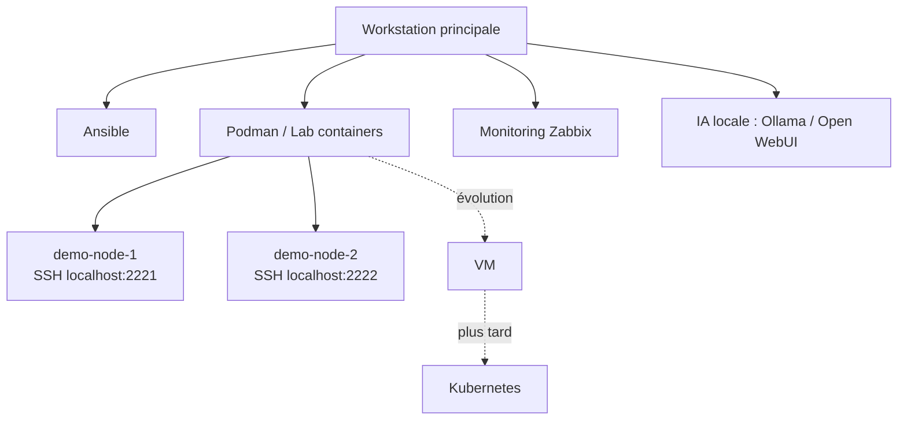

# Homelab Infra

Infrastructure de laboratoire pour expérimenter l’automatisation système avec Ansible, dans un environnement reproductible basé sur des containers.

---

## Objectif

Ce projet me permet de :

- apprendre et structurer l’usage d’Ansible  
- tester le déploiement de services  
- expérimenter le monitoring (Zabbix)  
- construire une infrastructure locale reproductible  

---

## Architecture

Le lab repose sur des nodes éphémères créés avec Podman.

Chaque node simule une machine accessible en SSH :

- demo-node-1 → localhost:2221  
- demo-node-2 → localhost:2222  

Un utilisateur `ansible` est automatiquement configuré avec une clé SSH.

---

## Lancer le lab

Créer les nodes :

```bash
./bootstrap/lab.sh up 2
```

Voir le statut :

```bash
./bootstrap/lab.sh status
```

Supprimer le lab :

```bash
./bootstrap/lab.sh down
```

---

## Tester Ansible

Test de connectivité :

```bash
ansible demo_nodes -m ping
```

Playbook de test :

```bash
ansible-playbook ansible/playbooks/playbook-trace.yml
```

---

## Déploiement d’un service (exemple : site Hugo)

Ce projet inclut un exemple complet de déploiement d’un site statique via nginx.

### 1. Générer le site

```bash
cd homelab-site
hugo
```

### 2. Lancer le lab

```bash
./bootstrap/lab.sh up 1
```

### 3. Déployer avec Ansible

```bash
ansible-playbook ansible/playbooks/lab_site.yml
```

### Accès

http://localhost:8080

### Principe

- nginx est installé sur le node  
- le site généré (`public/`) est déployé  
- la configuration nginx est appliquée automatiquement  

---

## Concepts clés

- nodes éphémères → reconstruction complète via Ansible  
- séparation infra / contenu  
- orchestration via playbooks  
- automatisation du déploiement de services  

---

## Structure du projet

```
homelab-infra
├── ansible.cfg
├── ansible
│   ├── inventory
│   ├── group_vars
│   ├── playbooks
│   └── roles
├── bootstrap
│   └── lab.sh
├── homelab-site
└── Notes.md
```

---

## Topologie actuelle du homelab

```
[Workstation principale]
  ├─ Ansible
  ├─ Podman / Lab containers
  │   ├─ demo-node-1 (SSH localhost:2221)
  │   └─ demo-node-2 (SSH localhost:2222)
  │
  ├─ Monitoring
  │   └─ Zabbix
  │
  └─ IA locale
      ├─ Ollama
      └─ Open WebUI
```

---

## Schéma du lab



---

## Roadmap

- structurer les rôles Ansible  
- déployer Zabbix agent  
- ajouter des nodes VM  
- explorer un inventory dynamique  

---

## Statut

Projet en évolution continue.
