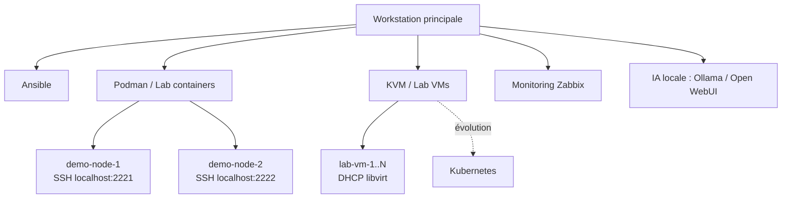

# Homelab Infra

Infrastructure de laboratoire pour expérimenter l'automatisation système avec Ansible, dans un environnement reproductible basé sur des containers et des VMs KVM.

---

## Prérequis

### Lab containers (Podman)

- Podman installé
- Clé SSH générée automatiquement par `lab.sh` au premier lancement

### Lab VMs (KVM)

- `libvirt`, `virt-install`, `qemu-img`, `cloud-localds` installés
- Image de base Debian 12 cloud : `/var/lib/libvirt/images/debian-12-generic-amd64.qcow2`
- Clé SSH `~/.ssh/homelab_ansible_ed25519` présente
- Lancer `vm.sh` avec `sudo`

### Ansible

- Ansible installé
- Collection `community.zabbix` : `ansible-galaxy collection install community.zabbix`

### Inventory Zabbix (optionnel)

L'inventory dynamique Zabbix est exclu du repo (credentials en clair, bug connu community.zabbix#713).

Pour l'utiliser, copier le fichier exemple et renseigner les credentials :

```bash
cp ansible/inventory/zabbix_inventory.yml.example ansible/inventory/zabbix_inventory.yml
```

Puis l'appeler explicitement :

```bash
ansible-inventory -i ansible/inventory/zabbix_inventory.yml --list
```

> Note : la résolution de variables Ansible Vault dans ce plugin n'est pas fonctionnelle en 4.1.1 (bug non corrigé depuis 2022).

---

## Objectif

Ce projet me permet de :

- apprendre et structurer l'usage d'Ansible
- tester le déploiement de services
- expérimenter le monitoring (Zabbix)
- construire une infrastructure locale reproductible

---

## Architecture

Le lab repose sur deux types de nodes :

### Containers Podman (éphémères)

Nodes légers pour tester les playbooks Ansible rapidement :

- demo-node-1 → localhost:2221
- demo-node-2 → localhost:2222

Un utilisateur `ansible` est automatiquement configuré avec une clé SSH.

### VMs KVM

VMs complètes provisionnées via cloud-init, plus proches d'un environnement réel :

- Debian 12, 2 vCPU, 2 Go RAM, 20 Go disque (paramètres par défaut)
- IP assignée par DHCP sur le réseau `default` libvirt
- Utilisateur `ansible` configuré automatiquement via cloud-init

---

## Lancer le lab containers

Créer les nodes :

```bash
./bootstrap/lab.sh up 2
```

Voir le statut :

```bash
./bootstrap/lab.sh status
```

Supprimer le lab :

```bash
./bootstrap/lab.sh down
```

---

## Lancer le lab VMs

Créer les VMs :

```bash
sudo ./bootstrap/vm.sh up 2
```

Voir le statut :

```bash
sudo ./bootstrap/vm.sh status
```

Supprimer les VMs :

```bash
sudo ./bootstrap/vm.sh down
```

Variables d'environnement disponibles :

```bash
PROJECT=lab RAM=2048 VCPUS=2 DISK_SIZE=20G sudo ./bootstrap/vm.sh up 2
```

---

## Tester Ansible

Test de connectivité (containers) :

```bash
ansible demo_nodes -m ping
```

Test de connectivité (VMs, via inventory Zabbix) :

```bash
ansible-inventory -i ansible/inventory/zabbix_inventory.yml --list
```

Playbook de test :

```bash
ansible-playbook ansible/playbooks/playbook-trace.yml
```

---

## Déploiement d'un service (exemple : site Hugo)

Ce projet inclut un exemple complet de déploiement d'un site statique via nginx.

### 1. Générer le site

```bash
cd homelab-site
hugo
```

### 2. Lancer le lab

```bash
./bootstrap/lab.sh up 1
```

### 3. Déployer avec Ansible

```bash
ansible-playbook ansible/playbooks/lab_site.yml
```

### Accès

http://localhost:8080

### Principe

- nginx est installé sur le node
- le site généré (`public/`) est déployé
- la configuration nginx est appliquée automatiquement

---

## Concepts clés

- nodes éphémères → reconstruction complète via Ansible
- VMs provisionnées via cloud-init → infrastructure plus proche du réel
- séparation infra / contenu
- orchestration via playbooks
- automatisation du déploiement de services

---

## Structure du projet

```
homelab-infra
├── ansible.cfg
├── ansible
│   ├── inventory
│   ├── group_vars
│   ├── playbooks
│   └── roles
├── bootstrap
│   ├── lab.sh
│   └── vm.sh
├── homelab-site
└── Notes.md
```

---

## Topologie actuelle du homelab

```
[Workstation principale]
  ├─ Ansible
  ├─ Podman / Lab containers
  │   ├─ demo-node-1 (SSH localhost:2221)
  │   └─ demo-node-2 (SSH localhost:2222)
  │
  ├─ KVM / Lab VMs
  │   └─ lab-vm-1..N (DHCP, réseau libvirt)
  │
  ├─ Monitoring
  │   └─ Zabbix
  │
  └─ IA locale
      ├─ Ollama
      └─ Open WebUI
```

---

## Schéma du lab



---
## CI/CD

Ce projet utilise GitHub Actions avec un self-hosted runner.

Le workflow se déclenche automatiquement sur push si des fichiers `ansible/` sont modifiés, ou manuellement via l'interface GitHub.

### Ce que fait le pipeline

1. Clone le repo
2. Génère le site Hugo
3. Vérifie que les containers Podman sont actifs
4. Lance le playbook Ansible

### Prérequis

Le self-hosted runner doit tourner sur la workstation et les containers Podman doivent être up pour que le déploiement aboutisse.

## Roadmap

- structurer les rôles Ansible
- déployer Zabbix agent
- stabiliser l'inventory dynamique des VMs
- GitHub Actions : déclencher un playbook sur push

---

## Statut

Projet en évolution continue.
